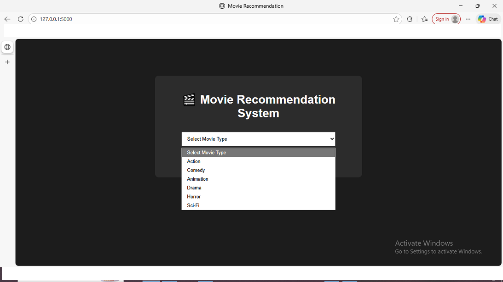
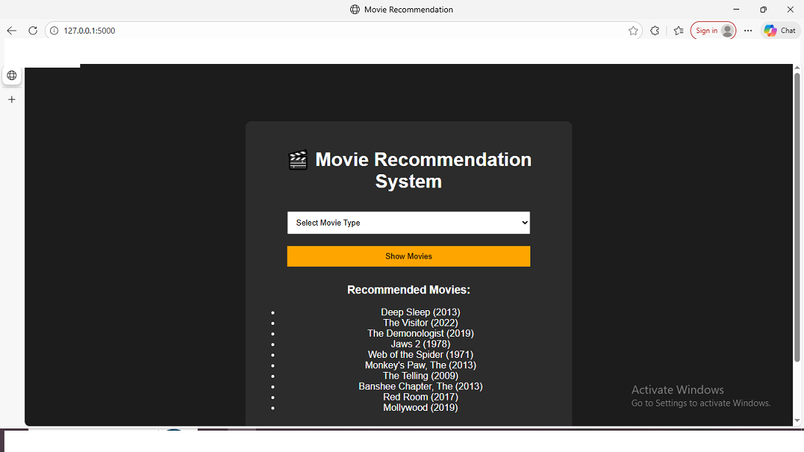

# 🎬 Movie Recommendation System

A content-based movie recommendation system using Natural Language Processing (NLP) techniques.

---

## 🚀 Features
- Recommends movies based on user-selected genres
- Uses TF-IDF Vectorization
- Cosine Similarity for recommendation
- Flask-based web interface

---

## 🛠️ Technologies Used
- Python
- Pandas
- Scikit-learn
- TF-IDF
- Cosine Similarity
- Flask
- HTML / CSS

---

---


## 🖼️ Application Screenshots

### 🏠 Home Page
This is the landing page of the Movie Recommendation System.



---

### ⭐ Movie Recommendations
This page displays recommended movies based on the selected genre.




## ▶️ How to Run the Project

```bash
pip install -r requirements.txt
python app.py
